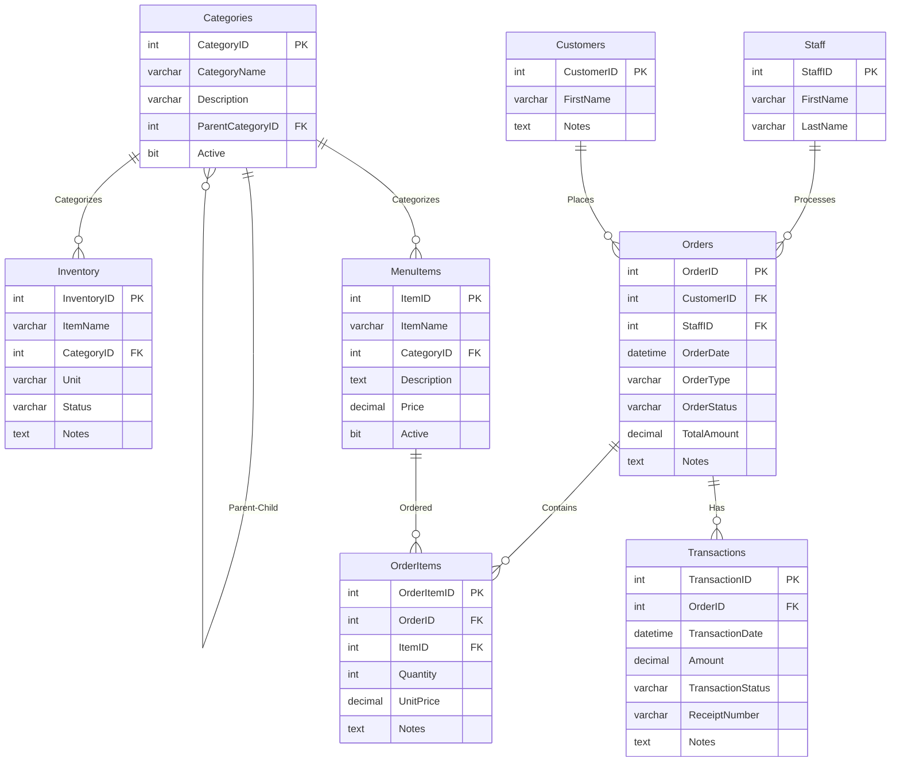
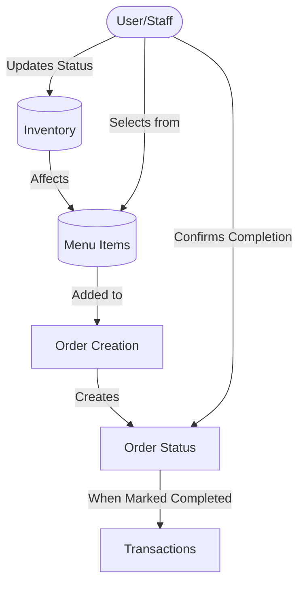

# BrewCode POS Database Diagram (Mermaid)

## Entity Relationship Diagram

## Flow Diagram

## Key Database Features:

1. **Status-Based Inventory System**:
   - Ingredients can be marked as "Available", "Not Available", or "Low Stock"
   - No automatic quantity tracking - status is updated manually by staff

2. **Menu Availability Logic**:
   - Menu item availability is determined by ingredient status
   - When key ingredients are unavailable, related menu items become inactive

3. **Order Processing Workflow**:
   - Orders move through defined statuses: Pending → Preparing → Ready → Delivered → Completed
   - Payment status tracked separately: Unpaid → Paid → Refunded (if needed)

4. **Hierarchical Categories**:
   - Categories can have parent-child relationships
   - Allows for organizing both menu items and inventory items
