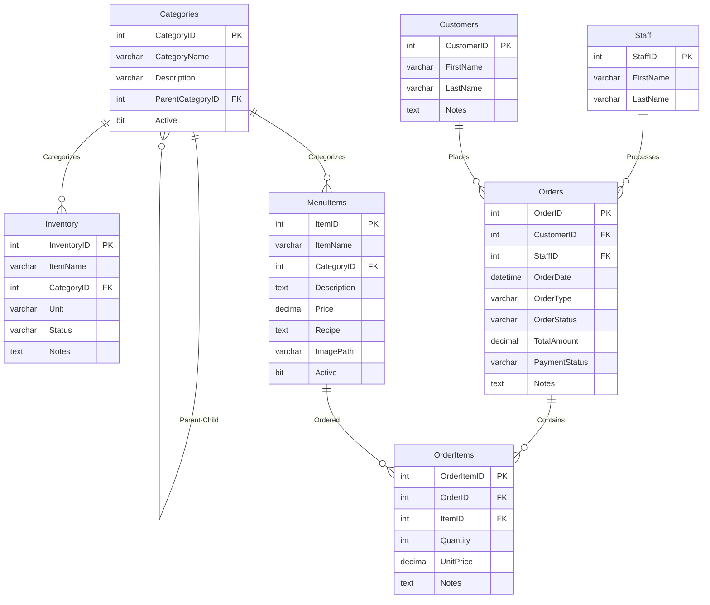

```mermaid
erDiagram
    Categories {
        int CategoryID PK
        varchar CategoryName
        varchar Description
        int ParentCategoryID FK
        bit Active
    }

    Inventory {
        int InventoryID PK
        varchar ItemName
        int CategoryID FK
        varchar Unit
        varchar Status
        text Notes
    }

    MenuItems {
        int ItemID PK
        varchar ItemName
        int CategoryID FK
        text Description
        decimal Price
        text Recipe
        varchar ImagePath
        bit Active
    }

    Staff {
        int StaffID PK
        varchar FirstName
        varchar LastName
    }

    Customers {
        int CustomerID PK
        varchar FirstName
        varchar LastName
        text Notes
    }

    Orders {
        int OrderID PK
        int CustomerID FK
        int StaffID FK
        datetime OrderDate
        varchar OrderType
        varchar OrderStatus
        decimal TotalAmount
        varchar PaymentStatus
        text Notes
    }

    OrderItems {
        int OrderItemID PK
        int OrderID FK
        int ItemID FK
        int Quantity
        decimal UnitPrice
        text Notes
    }

    Categories ||--o{ Categories : "Parent-Child"
    Categories ||--o{ Inventory : "Categorizes"
    Categories ||--o{ MenuItems : "Categorizes"
    Staff ||--o{ Orders : "Processes"
    Customers ||--o{ Orders : "Places"
    Orders ||--o{ OrderItems : "Contains"
    MenuItems ||--o{ OrderItems : "Ordered"
```
